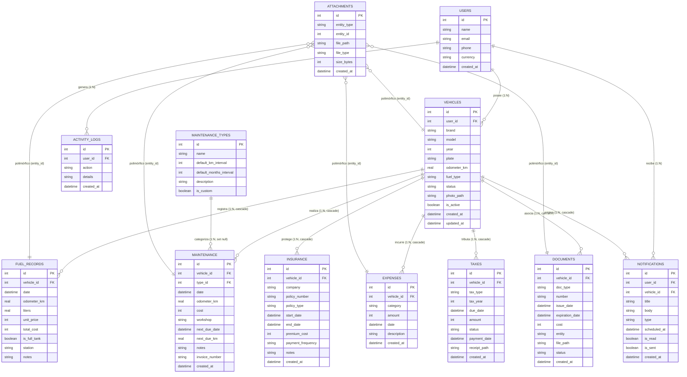

# BASE DE DATOS — AutoAlDía

Este documento especifica formalmente el diseño de datos de **AutoAlDía**, cumpliendo con la subsección **Base de datos** de la Sección 68 del documento de requerimientos del sistema:
- Modelo entidad-relación.
- Tablas.
- Relaciones.
- Índices.
- Restricciones.

---

## 1. Modelo Entidad-Relación (ER)



---

## 2. Catálogo de Tablas del MVP

### 2.1. `users` (Perfil Local)
Almacena el perfil único del dispositivo. En el MVP solo contiene 1 registro local.
- `id` (INTEGER, PK, Autoincrement)
- `name` (TEXT, NOT NULL, max 100)
- `email` (TEXT, NULLABLE)
- `phone` (TEXT, NULLABLE)
- `currency` (TEXT, NOT NULL, DEFAULT 'COP')
- `created_at` (DATETIME, NOT NULL, DEFAULT CURRENT_TIMESTAMP)

### 2.2. `vehicles` (Garaje del Usuario)
Registra todos los vehículos administrados por el usuario.
- `id` (INTEGER, PK, Autoincrement)
- `user_id` (INTEGER, NOT NULL, FK `users.id` CASCADE)
- `brand` (TEXT, NOT NULL, max 80)
- `model` (TEXT, NOT NULL, max 80)
- `year` (INTEGER, NULLABLE)
- `plate` (TEXT, NULLABLE, max 20)
- `odometer_km` (REAL, NOT NULL, DEFAULT 0.0)
- `fuel_type` (TEXT, NOT NULL) — `gasolina`, `diesel`, `electrico`, `hibrido`
- `status` (TEXT, NOT NULL, DEFAULT 'activo') — `activo`, `inactivo`, `vendido`
- `photo_path` (TEXT, NULLABLE)
- `is_active` (BOOLEAN, NOT NULL, DEFAULT FALSE)
- `created_at` (DATETIME, NOT NULL, DEFAULT CURRENT_TIMESTAMP)
- `updated_at` (DATETIME, NOT NULL, DEFAULT CURRENT_TIMESTAMP)

### 2.3. `fuel_records` (Tanqueadas)
Registro detallado del consumo de combustible.
- `id` (INTEGER, PK, Autoincrement)
- `vehicle_id` (INTEGER, NOT NULL, FK `vehicles.id` CASCADE)
- `date` (DATETIME, NOT NULL)
- `odometer_km` (REAL, NOT NULL)
- `liters` (REAL, NOT NULL)
- `unit_price` (INTEGER, NOT NULL) — Precio por unidad en enteros (COP)
- `total_cost` (INTEGER, NOT NULL) — Monto total en enteros (COP)
- `is_full_tank` (BOOLEAN, NOT NULL)
- `station` (TEXT, NULLABLE)
- `notes` (TEXT, NULLABLE)

### 2.4. `maintenance_types` (Catálogo Preventivo)
Tipos de servicio con intervalos predeterminados sugeridos.
- `id` (INTEGER, PK, Autoincrement)
- `name` (TEXT, NOT NULL) — ej. "Cambio de aceite", "Filtro de aire", "Pastillas de freno"
- `default_km_interval` (INTEGER, NULLABLE) — ej. 10.000 km
- `default_months_interval` (INTEGER, NULLABLE) — ej. 6 meses
- `description` (TEXT, NULLABLE)
- `is_custom` (BOOLEAN, NOT NULL, DEFAULT FALSE)

### 2.5. `maintenance` (Bitácora de Servicios)
Historial y programación de intervenciones mecánicas.
- `id` (INTEGER, PK, Autoincrement)
- `vehicle_id` (INTEGER, NOT NULL, FK `vehicles.id` CASCADE)
- `type_id` (INTEGER, NULLABLE, FK `maintenance_types.id` SET NULL)
- `date` (DATETIME, NOT NULL)
- `odometer_km` (REAL, NOT NULL)
- `cost` (INTEGER, NOT NULL)
- `workshop` (TEXT, NULLABLE)
- `next_due_date` (DATETIME, NULLABLE)
- `next_due_km` (REAL, NULLABLE)
- `notes` (TEXT, NULLABLE)
- `invoice_number` (TEXT, NULLABLE)
- `created_at` (DATETIME, NOT NULL, DEFAULT CURRENT_TIMESTAMP)

### 2.6. `expenses` (Gastos Varios)
Control financiero de peajes, parqueaderos, lavados, etc.
- `id` (INTEGER, PK, Autoincrement)
- `vehicle_id` (INTEGER, NOT NULL, FK `vehicles.id` CASCADE)
- `category` (TEXT, NOT NULL) — `peaje`, `parqueadero`, `lavado`, `repuesto`, `multa`, `otro`
- `amount` (INTEGER, NOT NULL) — Valor en enteros (COP)
- `date` (DATETIME, NOT NULL)
- `description` (TEXT, NULLABLE)
- `created_at` (DATETIME, NOT NULL, DEFAULT CURRENT_TIMESTAMP)

### 2.7. `documents` (Documentación Legal)
SOAT, Revisión Técnico-mecánica, Licencias, etc.
- `id` (INTEGER, PK, Autoincrement)
- `vehicle_id` (INTEGER, NOT NULL, FK `vehicles.id` CASCADE)
- `doc_type` (TEXT, NOT NULL) — `soat`, `tecnicomecanica`, `tarjeta_propiedad`, `licencia`, `otro`
- `number` (TEXT, NULLABLE)
- `issue_date` (DATETIME, NULLABLE)
- `expiration_date` (DATETIME, NOT NULL)
- `cost` (INTEGER, NOT NULL, DEFAULT 0)
- `entity` (TEXT, NULLABLE)
- `file_path` (TEXT, NULLABLE)
- `status` (TEXT, NOT NULL, DEFAULT 'vigente') — `vigente`, `proximo`, `vencido`
- `created_at` (DATETIME, NOT NULL, DEFAULT CURRENT_TIMESTAMP)

### 2.8. `insurance` (Pólizas y Seguros)
- `id` (INTEGER, PK, Autoincrement)
- `vehicle_id` (INTEGER, NOT NULL, FK `vehicles.id` CASCADE)
- `company` (TEXT, NOT NULL)
- `policy_number` (TEXT, NOT NULL)
- `policy_type` (TEXT, NOT NULL) — `todo_riesgo`, `responsabilidad_civil`, `otro`
- `start_date` (DATETIME, NOT NULL)
- `end_date` (DATETIME, NOT NULL)
- `premium_cost` (INTEGER, NOT NULL)
- `payment_frequency` (TEXT, NOT NULL, DEFAULT 'anual')
- `notes` (TEXT, NULLABLE)
- `created_at` (DATETIME, NOT NULL, DEFAULT CURRENT_TIMESTAMP)

### 2.9. `taxes` (Impuestos Vehiculares)
- `id` (INTEGER, PK, Autoincrement)
- `vehicle_id` (INTEGER, NOT NULL, FK `vehicles.id` CASCADE)
- `tax_type` (TEXT, NOT NULL) — `departamental`, `semaforizacion`, `municipal`
- `tax_year` (INTEGER, NOT NULL)
- `due_date` (DATETIME, NOT NULL)
- `amount` (INTEGER, NOT NULL)
- `status` (TEXT, NOT NULL, DEFAULT 'pendiente') — `pendiente`, `pagado`, `vencido`
- `payment_date` (DATETIME, NULLABLE)
- `receipt_path` (TEXT, NULLABLE)
- `created_at` (DATETIME, NOT NULL, DEFAULT CURRENT_TIMESTAMP)

### 2.10. `notifications` (Centro de Alertas)
- `id` (INTEGER, PK, Autoincrement)
- `user_id` (INTEGER, NOT NULL, FK `users.id` CASCADE)
- `vehicle_id` (INTEGER, NULLABLE, FK `vehicles.id` CASCADE)
- `title` (TEXT, NOT NULL)
- `body` (TEXT, NOT NULL)
- `type` (TEXT, NOT NULL) — `document_expiry`, `maintenance_km`, `maintenance_date`, `payment_due`
- `scheduled_at` (DATETIME, NOT NULL)
- `is_read` (BOOLEAN, NOT NULL, DEFAULT FALSE)
- `is_sent` (BOOLEAN, NOT NULL, DEFAULT FALSE)
- `created_at` (DATETIME, NOT NULL, DEFAULT CURRENT_TIMESTAMP)

### 2.11. `attachments` (Archivos Polimórficos)
- `id` (INTEGER, PK, Autoincrement)
- `entity_type` (TEXT, NOT NULL) — `vehicle`, `fuel`, `maintenance`, `expense`, `document`
- `entity_id` (INTEGER, NOT NULL)
- `file_path` (TEXT, NOT NULL)
- `file_type` (TEXT, NOT NULL) — `image/jpeg`, `image/png`, `application/pdf`
- `size_bytes` (INTEGER, NOT NULL)
- `created_at` (DATETIME, NOT NULL, DEFAULT CURRENT_TIMESTAMP)

### 2.12. `activity_logs` (Trazabilidad Local)
- `id` (INTEGER, PK, Autoincrement)
- `user_id` (INTEGER, NOT NULL, FK `users.id` CASCADE)
- `action` (TEXT, NOT NULL) — `create_vehicle`, `record_fuel`, `delete_expense`, etc.
- `details` (TEXT, NULLABLE)
- `created_at` (DATETIME, NOT NULL, DEFAULT CURRENT_TIMESTAMP)

---

## 3. Relaciones y Cascada

1. **Activación de Claves Foráneas:**
   - En SQLite las foreign keys vienen inactivas por conexión. Se garantiza su activación en `beforeOpen`:
     ```dart
     await customStatement('PRAGMA foreign_keys = ON');
     ```
2. **Borrado en Cascada (`ON DELETE CASCADE`):**
   - La eliminación de un registro en `vehicles` dispara automáticamente la eliminación de todas sus filas en:
     - `fuel_records`
     - `maintenance`
     - `expenses`
     - `documents`
     - `insurance`
     - `taxes`
     - `notifications`
3. **Casos Especiales:**
   - `maintenance.type_id` utiliza `onDelete: KeyAction.setNull` para que si se borra un tipo del catálogo, el historial de mantenimientos realizados no se pierda.
   - `attachments` utiliza clave foránea lógica/polimórfica (`entity_type` + `entity_id`), por lo que su limpieza física se ejecuta a través de `LocalStorageService.deleteVehicleDirectory(vehicleId)`.

---

## 4. Índices de Rendimiento

Para garantizar búsquedas instantáneas y fluidez en el Dashboard:
1. `vehicles_user_plate_idx` (`vehicles`): `(user_id, plate)` — Garantiza unicidad de la placa por usuario y acelera búsquedas.
2. `fuel_records_vehicle_date_idx` (`fuel_records`): `(vehicle_id, date)` — Optimiza el cálculo de consumo y el ordenamiento cronológico.
3. `maintenance_vehicle_date_idx` (`maintenance`): `(vehicle_id, date)` — Optimiza la consulta del historial de mantenimiento.
4. `expenses_vehicle_date_idx` (`expenses`): `(vehicle_id, date)` — Optimiza los totales mensuales y reportes por categoría.
5. `documents_vehicle_expiry_idx` (`documents`): `(vehicle_id, expiration_date)` — Permite identificar vencimientos inmediatos sin escanear toda la tabla.
6. `notifications_scheduled_idx` (`notifications`): `(user_id, scheduled_at, is_read)` — Para el badge de notificaciones no leídas.

---

## 5. Restricciones de Integridad y Convenciones

1. **Convención Monetaria:**
   - Todo campo monetario (`amount`, `unit_price`, `total_cost`, `cost`, `premium_cost`) es **`INTEGER`**, almacenado en la unidad mínima (pesos colombianos COP sin decimales).
   - Prohibido el tipo `REAL` para valores económicos para evitar inconsistencias por redondeo en sumatorias.
2. **Campos Requeridos vs. Opcionales:**
   - Campos de auditoría (`created_at`) siempre presentes con valor por defecto `CURRENT_TIMESTAMP`.
   - Placa de vehículo y año son opcionales en el modelo (para contemplar vehículos sin matricular, maquinaria o bicicletas con odómetro), pero validados por regla de negocio según el tipo de vehículo.
3. **Enums Flexibles:**
   - Tipos de combustible (`gasolina`, `diesel`, `electrico`, `hibrido`) y categorías de gastos se guardan como cadenas de texto (`TEXT`) validadas en dominio, permitiendo incorporar nuevos tipos sin alterar el esquema físico.
