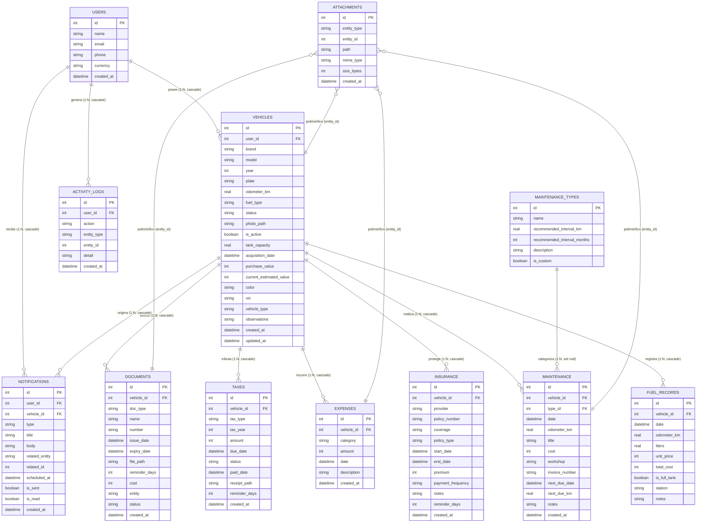

# BASE DE DATOS — AutoAlDía

Este documento especifica formalmente el diseño de datos de **AutoAlDía**, cumpliendo con la subsección **Base de datos** de la Sección 68 del documento de requerimientos del sistema:
- Modelo entidad-relación.
- Tablas.
- Relaciones.
- Índices.
- Restricciones.

> **Fuente única de verdad:** el catálogo de este documento refleja **campo por campo** las tablas Drift en `lib/**/data/tables/`. Cualquier cambio de esquema debe aplicarse primero en Drift y luego sincronizarse aquí (ver reglas de migración en `ARQUITECTURA.md`).

---

## 1. Modelo Entidad-Relación (ER)



---

## 2. Catálogo de Tablas del MVP

> Convención de nombres: columnas en **snake_case** en SQLite; en Drift se declaran en camelCase y el motor las mapea automáticamente. `DEFAULT CURRENT_TIMESTAMP` es gestionado por Drift (`currentDateAndTime`) en la capa de datos.

### 2.1. `users` (Perfil Local)
Almacena el perfil único del dispositivo. En el MVP solo contiene 1 registro local.
- `id` (INTEGER, PK, Autoincrement)
- `name` (TEXT, NOT NULL, max 120)
- `email` (TEXT, NULLABLE)
- `phone` (TEXT, NULLABLE)
- `currency` (TEXT, NOT NULL, DEFAULT 'COP')
- `created_at` (DATETIME, NOT NULL, DEFAULT CURRENT_TIMESTAMP)

### 2.2. `vehicles` (Garaje del Usuario)
Registra todos los vehículos administrados por el usuario.
- `id` (INTEGER, PK, Autoincrement)
- `user_id` (INTEGER, NOT NULL, FK `users.id` CASCADE)
- `brand` (TEXT, NOT NULL, max 80)
- `model` (TEXT, NOT NULL, max 80)
- `year` (INTEGER, NULLABLE)
- `plate` (TEXT, NULLABLE, max 20)
- `odometer_km` (REAL, NOT NULL) — Kilometraje actual; requerido al insertar
- `fuel_type` (TEXT, NOT NULL, max 20) — `gasolina`, `diesel`, `electrico`, `hibrido`
- `status` (TEXT, NOT NULL, DEFAULT 'activo') — `activo`, `inactivo`, `vendido`
- `photo_path` (TEXT, NULLABLE) — Ruta **relativa** dentro de `app_documents/vehicles/{id}/photos/`
- `is_active` (BOOLEAN, NOT NULL, DEFAULT FALSE) — Vehículo activo seleccionado (fuente única de verdad)
- `tank_capacity` (REAL, NULLABLE) — Capacidad del tanque en litros
- `acquisition_date` (DATETIME, NULLABLE) — Fecha de adquisición
- `purchase_value` (INTEGER, NULLABLE) — Valor de compra (unidad mínima COP)
- `current_estimated_value` (INTEGER, NULLABLE) — Valor actual estimado (unidad mínima COP)
- `color` (TEXT, NULLABLE, max 40)
- `vin` (TEXT, NULLABLE, max 30) — Número de identificación vehicular
- `vehicle_type` (TEXT, NULLABLE, max 30) — `carro`, `moto`, `camioneta`, `otro`
- `observations` (TEXT, NULLABLE, max 500) — Notas libres
- `created_at` (DATETIME, NOT NULL, DEFAULT CURRENT_TIMESTAMP)
- `updated_at` (DATETIME, NOT NULL, DEFAULT CURRENT_TIMESTAMP)

### 2.3. `fuel_records` (Tanqueadas)
Registro detallado del consumo de combustible.
- `id` (INTEGER, PK, Autoincrement)
- `vehicle_id` (INTEGER, NOT NULL, FK `vehicles.id` CASCADE)
- `date` (DATETIME, NOT NULL)
- `odometer_km` (REAL, NOT NULL)
- `liters` (REAL, NOT NULL)
- `unit_price` (INTEGER, NOT NULL) — Precio por unidad en enteros (COP)
- `total_cost` (INTEGER, NOT NULL) — Monto total en enteros (COP)
- `is_full_tank` (BOOLEAN, NOT NULL) — true = tanque lleno (referencia para cálculo de consumo)
- `station` (TEXT, NULLABLE)
- `notes` (TEXT, NULLABLE)

### 2.4. `maintenance_types` (Catálogo Preventivo)
Tipos de servicio con intervalos predeterminados sugeridos.
- `id` (INTEGER, PK, Autoincrement)
- `name` (TEXT, NOT NULL, max 80, UNIQUE) — ej. "Cambio de aceite"
- `recommended_interval_km` (REAL, NULLABLE) — Intervalo recomendado en km
- `recommended_interval_months` (INTEGER, NULLABLE) — Intervalo recomendado en meses
- `description` (TEXT, NULLABLE)
- `is_custom` (BOOLEAN, NOT NULL, DEFAULT FALSE) — true si lo creó el usuario

### 2.5. `maintenance` (Bitácora de Servicios)
Historial y programación de intervenciones mecánicas.
- `id` (INTEGER, PK, Autoincrement)
- `vehicle_id` (INTEGER, NOT NULL, FK `vehicles.id` CASCADE)
- `type_id` (INTEGER, NULLABLE, FK `maintenance_types.id` SET NULL)
- `date` (DATETIME, NOT NULL)
- `odometer_km` (REAL, NULLABLE) — Nullable por registros históricos sin odómetro
- `title` (TEXT, NOT NULL, max 120) — Descripción corta del servicio realizado
- `cost` (INTEGER, NOT NULL) — Unidad mínima (COP)
- `workshop` (TEXT, NULLABLE) — Taller que realizó el servicio
- `invoice_number` (TEXT, NULLABLE) — Número de factura
- `next_due_date` (DATETIME, NULLABLE) — Recordatorio por fecha (si se definió)
- `next_due_km` (REAL, NULLABLE) — Recordatorio por kilometraje (si se definió)
- `notes` (TEXT, NULLABLE)
- `created_at` (DATETIME, NOT NULL, DEFAULT CURRENT_TIMESTAMP)

### 2.6. `expenses` (Gastos Varios)
Control financiero de peajes, parqueaderos, lavados, etc.
- `id` (INTEGER, PK, Autoincrement)
- `vehicle_id` (INTEGER, NOT NULL, FK `vehicles.id` CASCADE)
- `category` (TEXT, NOT NULL, max 60) — `peaje`, `parqueadero`, `lavado`, `repuesto`, `multa`, `otro`
- `amount` (INTEGER, NOT NULL) — Valor en enteros (COP)
- `date` (DATETIME, NOT NULL)
- `description` (TEXT, NULLABLE)
- `created_at` (DATETIME, NOT NULL, DEFAULT CURRENT_TIMESTAMP)

### 2.7. `documents` (Documentación Legal)
SOAT, Revisión Técnico-mecánica, Licencias, etc.
- `id` (INTEGER, PK, Autoincrement)
- `vehicle_id` (INTEGER, NOT NULL, FK `vehicles.id` CASCADE)
- `doc_type` (TEXT, NOT NULL, max 30) — `soat`, `tecnicomecanica`, `seguro`, `otro`
- `name` (TEXT, NOT NULL, max 120) — Nombre del documento
- `number` (TEXT, NULLABLE)
- `issue_date` (DATETIME, NULLABLE)
- `expiry_date` (DATETIME, NOT NULL) — Fecha de vencimiento (base de las alertas de caducidad)
- `file_path` (TEXT, NULLABLE) — Ruta **relativa** dentro de `app_documents/documents/{id}/`
- `reminder_days` (INTEGER, NOT NULL, DEFAULT 15) — Días de anticipación de la alerta
- `cost` (INTEGER, NOT NULL, DEFAULT 0) — Unidad mínima (COP)
- `entity` (TEXT, NULLABLE) — Entidad que expide el documento
- `status` (TEXT, NOT NULL, DEFAULT 'vigente') — `vigente`, `proximo`, `vencido`
- `created_at` (DATETIME, NOT NULL, DEFAULT CURRENT_TIMESTAMP)

### 2.8. `insurance` (Pólizas y Seguros)
- `id` (INTEGER, PK, Autoincrement)
- `vehicle_id` (INTEGER, NOT NULL, FK `vehicles.id` CASCADE)
- `provider` (TEXT, NOT NULL, max 120) — Aseguradora
- `policy_number` (TEXT, NULLABLE)
- `coverage` (TEXT, NULLABLE) — Cobertura contratada
- `policy_type` (TEXT, NOT NULL) — `todo_riesgo`, `responsabilidad_civil`, `otro`
- `start_date` (DATETIME, NULLABLE)
- `end_date` (DATETIME, NOT NULL) — Alimenta las alertas de vencimiento
- `premium` (INTEGER, NULLABLE) — Prima (unidad mínima COP)
- `payment_frequency` (TEXT, NOT NULL, DEFAULT 'anual') — `anual`, `semestral`, `trimestral`, `mensual`
- `notes` (TEXT, NULLABLE)
- `reminder_days` (INTEGER, NOT NULL, DEFAULT 15) — Días de anticipación de la alerta
- `created_at` (DATETIME, NOT NULL, DEFAULT CURRENT_TIMESTAMP)

### 2.9. `taxes` (Impuestos Vehiculares)
- `id` (INTEGER, PK, Autoincrement)
- `vehicle_id` (INTEGER, NOT NULL, FK `vehicles.id` CASCADE)
- `tax_type` (TEXT, NOT NULL, max 60) — `departamental`, `semaforizacion`, `municipal`
- `tax_year` (INTEGER, NOT NULL) — Año fiscal (ej. 2026)
- `amount` (INTEGER, NOT NULL) — Unidad mínima (COP)
- `due_date` (DATETIME, NOT NULL)
- `status` (TEXT, NOT NULL, DEFAULT 'pendiente') — `pendiente`, `pagado`, `vencido`
- `paid_date` (DATETIME, NULLABLE) — Null = impuesto aún no pagado
- `receipt_path` (TEXT, NULLABLE) — Ruta **relativa** del comprobante dentro de `app_documents/...`
- `reminder_days` (INTEGER, NOT NULL, DEFAULT 15) — Días de anticipación de la alerta
- `created_at` (DATETIME, NOT NULL, DEFAULT CURRENT_TIMESTAMP)

### 2.10. `notifications` (Centro de Alertas)
- `id` (INTEGER, PK, Autoincrement)
- `user_id` (INTEGER, NOT NULL, FK `users.id` CASCADE)
- `vehicle_id` (INTEGER, NULLABLE, FK `vehicles.id` CASCADE) — Nullable para alertas globales
- `type` (TEXT, NOT NULL, max 30) — `doc_expiry`, `maintenance_due`, `km_reached`
- `title` (TEXT, NOT NULL, max 120)
- `body` (TEXT, NULLABLE)
- `related_entity` (TEXT, NULLABLE) — Origen de la alerta (documents, maintenance…)
- `related_id` (INTEGER, NULLABLE) — Id de la entidad origen (referencia genérica, sin FK)
- `scheduled_at` (DATETIME, NULLABLE) — Momento en que se dispara la alerta
- `is_sent` (BOOLEAN, NOT NULL, DEFAULT FALSE)
- `is_read` (BOOLEAN, NOT NULL, DEFAULT FALSE) — Para el badge de no leídas
- `created_at` (DATETIME, NOT NULL, DEFAULT CURRENT_TIMESTAMP)

### 2.11. `attachments` (Archivos Polimórficos)
- `id` (INTEGER, PK, Autoincrement)
- `entity_type` (TEXT, NOT NULL, max 30) — `vehicle`, `document`, `maintenance`, `expense`
- `entity_id` (INTEGER, NOT NULL)
- `path` (TEXT, NOT NULL) — Ruta **relativa** dentro de `app_documents/...` (nunca absolutas)
- `mime_type` (TEXT, NULLABLE) — `image/jpeg`, `image/png`, `application/pdf`
- `size_bytes` (INTEGER, NOT NULL) — Tamaño en bytes
- `created_at` (DATETIME, NOT NULL, DEFAULT CURRENT_TIMESTAMP)

### 2.12. `activity_logs` (Trazabilidad Local)
- `id` (INTEGER, PK, Autoincrement)
- `user_id` (INTEGER, NOT NULL, FK `users.id` CASCADE)
- `action` (TEXT, NOT NULL, max 20) — `created`, `updated`, `deleted`
- `entity_type` (TEXT, NOT NULL, max 30) — Módulo afectado (vehicle, fuel, expense…)
- `entity_id` (INTEGER, NULLABLE) — Referencia genérica, sin FK
- `detail` (TEXT, NULLABLE) — Detalle contextual del evento
- `created_at` (DATETIME, NOT NULL, DEFAULT CURRENT_TIMESTAMP)

---

## 3. Relaciones y Cascada

1. **Activación de Claves Foráneas:**
   - En SQLite las foreign keys vienen inactivas por conexión. Se garantiza su activación en `beforeOpen`:
     ```dart
     await customStatement('PRAGMA foreign_keys = ON');
     ```
2. **Borrado en Cascada (`ON DELETE CASCADE`):**
   - La eliminación de un registro en `vehicles` dispara automáticamente la eliminación de todas sus filas en:
     - `fuel_records`
     - `maintenance`
     - `expenses`
     - `documents`
     - `insurance`
     - `taxes`
     - `notifications`
   - La eliminación de un `user` dispara la eliminación de sus `vehicles`, `notifications` y `activity_logs`.
3. **Casos Especiales:**
   - `maintenance.type_id` utiliza `onDelete: KeyAction.setNull` para que si se borra un tipo del catálogo, el historial de mantenimientos realizados no se pierda.
   - `attachments` usa clave polimórfica (`entity_type`/`entity_id`) y `notifications.related_entity`/`related_id` referencia genérica, ambas **sin FK**; por eso el borrado físico de archivos lo ejecuta `LocalStorageService.deleteVehicleDirectory(vehicleId)`.

---

## 4. Índices de Rendimiento

Índices declarados en Drift (mapeados a snake_case):

| Tabla | Índice | Columnas | Nota |
|---|---|---|---|
| `vehicles` | `vehicles_user_plate_unique` | `(user_id, plate)` | ÚNICO: placa única por usuario |
| `fuel_records` | `fuel_records_vehicle_date_idx` | `(vehicle_id, date)` | Cálculo de consumo y orden cronológico |
| `maintenance` | `maintenance_vehicle_date_idx` | `(vehicle_id, date)` | Historial de mantenimiento |
| `expenses` | `expenses_vehicle_date_idx` | `(vehicle_id, date)` | Totales mensuales y reportes |
| `documents` | `documents_vehicle_idx` | `(vehicle_id)` | Consultas por vehículo |
| `documents` | `documents_expiry_idx` | `(expiry_date)` | Vencimientos inmediatos |
| `insurance` | `insurance_vehicle_idx` | `(vehicle_id)` | Consultas por vehículo |
| `insurance` | `insurance_end_date_idx` | `(end_date)` | Alertas de vencimiento |
| `taxes` | `taxes_vehicle_idx` | `(vehicle_id)` | Consultas por vehículo |
| `taxes` | `taxes_due_date_idx` | `(due_date)` | Alertas de vencimiento |
| `notifications` | `notifications_vehicle_idx` | `(vehicle_id)` | Consultas por vehículo |
| `notifications` | `notifications_scheduled_idx` | `(user_id, scheduled_at, is_read)` | Badge de no leídas |
| `attachments` | `attachments_entity_idx` | `(entity_type, entity_id)` | Adjuntos de una entidad |
| `activity_logs` | `activity_logs_entity_idx` | `(entity_type, entity_id)` | Trazabilidad por entidad |
| `activity_logs` | `activity_logs_created_idx` | `(created_at)` | Orden cronológico |

---

## 5. Restricciones de Integridad y Convenciones

1. **Convención Monetaria:**
   - Todo campo monetario (`amount`, `unit_price`, `total_cost`, `cost`, `premium`, `purchase_value`, `current_estimated_value`) es **`INTEGER`**, almacenado en la unidad mínima (pesos colombianos COP sin decimales).
   - Prohibido el tipo `REAL` para valores económicos para evitar inconsistencias por redondeo en sumatorias (ver `core/constants/money_convention.md`).
2. **Rutas de Archivos Relativas:**
   - `vehicles.photo_path`, `documents.file_path`, `taxes.receipt_path` y `attachments.path` guardan rutas **relativas** a `app_documents/`. Nunca rutas absolutas; se resuelven en tiempo de ejecución por `LocalStorageService`.
3. **Campos Requeridos vs. Opcionales:**
   - Campos de auditoría (`created_at`) siempre presentes con valor por defecto.
   - Placa y año de vehículo son opcionales (vehículos sin matricular, maquinaria, bicicletas con odómetro), pero validados por regla de negocio según el tipo de vehículo.
4. **Enums Flexibles:**
   - Tipos de combustible (`gasolina`, `diesel`, `electrico`, `hibrido`), categorías de gastos y estados se guardan como cadenas de texto (`TEXT`) validadas en dominio, permitiendo incorporar nuevos valores sin alterar el esquema físico.
5. **Vehículo Activo:**
   - Se persiste en `vehicles.is_active` (BOOLEAN, máximo una fila en true por usuario en el MVP). No se duplica en preferencias.